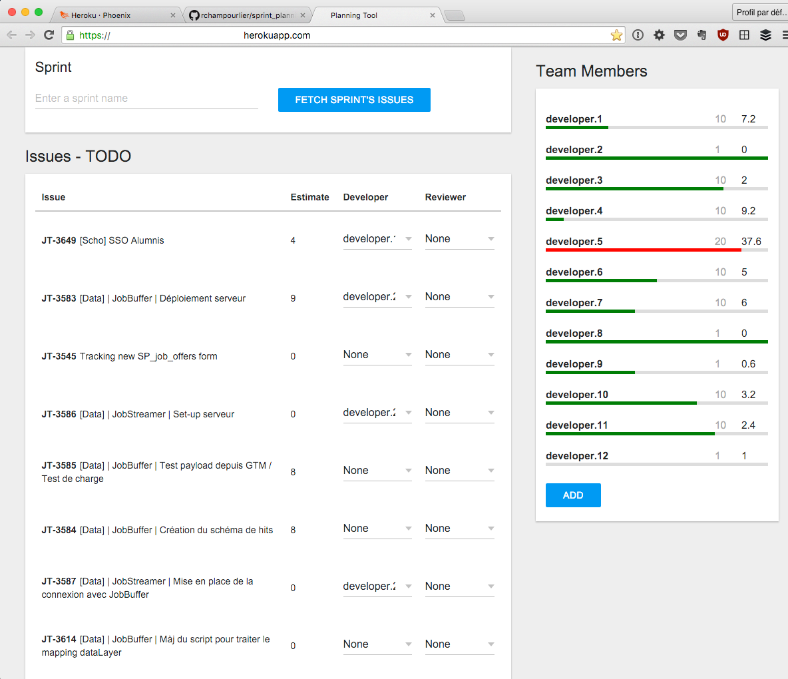

# Sprint Planning Tool

A _sur-mesure_ tool to help with sprint issues assignment to team members.



## What does it do?

- Displays a list of the issues in the currently open sprints (by default), or a sprint you specified by name.
- Allows the user to assign a developer and/or a reviewer to each issue.
- Performs each assignment on JIRA in the background.
- Displays available capacities for each team member and calculates the remaining capacity according to the current assignments.

## Nota Bene

This tool has been developed to serve [JobTeaser](https://www.jobteaser.com)'s development team and will require some changes to work in other contexts.

The client-side application (Elm, yeah!) should not require changes, however, the backend (Elixir, OMG!) will need some. We're using JIRA as a project management tool, and we have some custom fields to match with our development process. In particular, we have two custom fields, "Developer" and "Reviewer". Since the goal of this tool is assigning a developer and a reviewer to every issue of the upcoming sprint, it will not be useful unless you have equivalent fields in your JIRA app. And you will have to change any occurrence of `customfield_1060[01]` to match your own custom fields.

## How to use?

### Setup

Create a `.env` file (copy `.env.example`) and fill the appropriate environment variables.

### Main commands

- Start a console with `bin/console`
- Start a local development server with `bin/server-dev`
- Start a production server with `bin/server`
- Run tests with `bin/test`
- Deploy to Heroku (set the environment variables from `.env` and pushes to the `heroku` remote). This assumes you have an Heroku app setup for Phoenix (see [howto](http://www.phoenixframework.org/docs/heroku)).

The application runs on [`localhost:4000`](http://localhost:4000) by default.

### Deploy to Heroku

```
heroku create --buildpack "https://github.com/HashNuke/heroku-buildpack-elixir.git" <APP_NAME>
heroku buildpacks:add https://github.com/gjaldon/heroku-buildpack-phoenix-static.git
bin/deploy
```

NB: Compiling Elm on Heroku would require some adjustments to the buildpack, so instead, we will compile Elm to JS (into `web/static/vendor/main.js`) and leave Brunch to the rest. The compilation of Elm fails during the deployment but it does not harm. This is why we need this file versioned.
